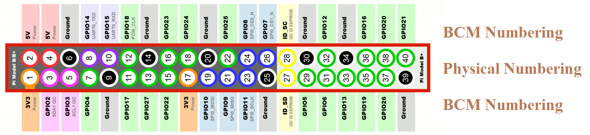
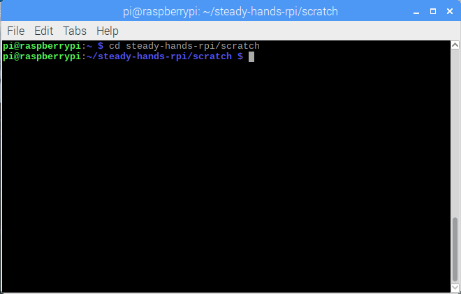

Steady hands game written in Scratch 2
=========================================

<!--Please use markdown-toc -i README.md to update the table of contents -->
<!-- -->
**Table of Contents**  *generated with [Markdown-TOC](https://www.npmjs.com/package/markdown-toc#install)*

<!-- toc -->

- [Quick Start](#quick-start)
- [Detailed Instructions](#detailed-instructions)
  * [Overview of the game](#overview-of-the-game)
  * [Numbering Schemes](#numbering-schemes)
  * [Hardware setup](#hardware-setup)
  * [Steps to generate and load the project](#steps-to-generate-and-load-the-project)
  * [Adjusting the Keyboard](#adjusting-the-keyboard)

<!-- tocstop -->

Quick Start
------------
 * Biuld the project by cd-ing to this directory and running: 
   ````
     ./build-project.sh 
   ````
   that would create a file named `steady-hands.sb2`

 * Open the file `steady-hands.sb2` as Scratch 2 project
 * Do the wiring appropriately. Instructions to come later
 * Press the flag icon to run the program

Detailed Instructions
---------------------

### Overview of the game

The steady hands game is a very old one. The main idea is that you should 
try to pass a ring wire all the way through a bent wire without touching the 
ring wire to the bent wire. Each touch gives you a failure point. 


### Numbering Schemes

Raspberry Pi is using two numbering schemes for its General Ports for Input and Output (GPIO).

 - BCM Numbering Schemes
 - Physical Numbering Scheme 
 
In our program we woud use the BCM Numbering scheme. In the image below these are the numbers 
prefixed by `GPIO` in the renctangles: 



### Hardware setup 

Let's do the hardware setup as shown below. We would use 

 - Port GPIO14 for the beginning (A)
 - Port GPIO18 for the bent wire (C)
 - Port GPIO23 for the ending    (B)
 - Port Ground for the ring      (D)
 


We would use

### Steps to generate and load the project

 1. Open a console terminal window:
   
   
 2. Clone the project from [https://github.com/ynedelchev/steady-hands-rpi/](https://github.com/ynedelchev/steady-hands-rpi/) using the command: 
   ```
   git clone https://github.com/ynedelchev/steady-hands-rpi/
   ```
   
   
   

 3. Go to the `steady-hands-rpi/scratch` folder
   ```
   cd steady-hands-rpi/scratch
   ```
   
  
 4. Scratch projects are zip packages that contain source code + resources, but are not effectively stored in source control. 
   That is why we have stored an unzipped version of the project file. To be able to load it via Scratch, we need to zip it 
   back. 
   Use the command: 
   ```
   ./build-project.sh
   ```
   
   
 
   As a result a file `steady-hands.sb2` will appear
 
   
    
 5. Start Scratch 2 from Raspberry Pi Menu - Programming - Scratch 2
 
   
    
 6. Lets add the module that allows us to work with GPIO. Go to `More Blocks` and then `Add an Extension`.
   
   
   
 7. Select the iconf for the PI GPIO extension and press OK. 
   
   
   
   As a result the additional block for working with GPIO will appear in the `More Blocks` section.
   
   
   
 8. Load the project by selecting File - Load Project.
   
   
   
 9. Select the project file that you have generated in step 4.
   
   
   
 10. You will be asked, whether you want to replace the existing project. Answer `OK` .
   
   
   
 11. Review the loaded program
   
   
   
 12. Run the program by pressing the flag icon. 
   
   
   
### Adjusting the Keyboard

 1. On the task bar on the top, click with the right mouse button to open a context menu and then select 
   `Add / Remove Panel Items`.
   
   
   
 2. In the dialog, scroll down and select `Keyboard Layout Handler`, then click `Preferences`:
   
   
   
 3. Adjust all the settings as per your preferences. In the below screenshot there are some sample settings: 
   
   
   
   The keyboard indicator will appear in the task panel on the top:
   
   

 4. Since there seem to be some sort of bug in raspberry pi and these settings
    are not survive a restart, here is what you need to do to make them 
    permanent. 

    a. Open the following file for editing (use escalated privileges or edit as root):
       ```
         sudo vim /etc/default/keyboard
       ```
       Instead of `vim`, you can also use `nano` or any other text editor as per your preference.

     b. Edit the file untill it looks like this:
       ```
       XKBMODEL="pc105"
       XKBLAYOUT="us,bg"
       XKBVARIANT=",phonetic"
       XKBOPTIONS="grp:lalt_lshift_toggle,compose:ralt,terminate:ctrl_alt_bksp"
       BACKSPACE="guess"
       ```
       Please note that valued `us` and `bg` for the `XKBLAYOUT` are the keyboard layouts for American English and Bulgarian. 

       Then the `,phonetic` in `XKBVARIANT`, represents the sub-variants in a comma separated list, 
       where we have an empty string for the `us` variant (which probably means the 
       default variant) and we have `phonetic` for the Bulgarian variant. 

       For Bulgarian, you could also use `bas_phonetic` which would bring you the 
       new phonetic invented in Bulgarian Academic of Science but not widespread 
       (versus `phonetic` that gives you the traditional phonetic layout - widespread).

       If you use empty string for the Bulgarian phonetic, then you would get the 
       typewriter standard also known as BDS (Bulgarian Darzhaven Standard).

       The value `grp:lalt_lshift_toggle` in `XKBOPTIONS` allows you to switch between
       American English and Bulgarian using the `Letf Alt` + `Left Shift` combination.

     c. Restart 
       ```
        sudo reboot
       ```
        
